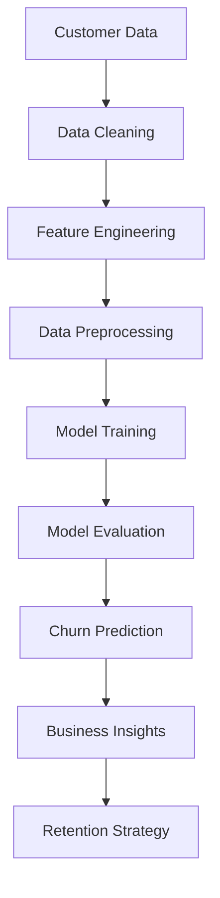

# 🚀 AI Customer Churn Prediction Platform

<div align="center">

# 🌌 CUSTOMER CHURN PREDICTION

### Powered by Artificial Intelligence & Predictive Analytics


</div>

---

# 🎥 3D Interactive Experience

```text
       ╭──────────────────────────────╮
       │                              │
       │      🤖 AI CORE SYSTEM       │
       │                              │
       ╰────────────┬─────────────────╯
                    │
          ┌─────────▼─────────┐
          │  CUSTOMER DATA    │
          └─────────┬─────────┘
                    │
          ┌─────────▼─────────┐
          │ MACHINE LEARNING  │
          └─────────┬─────────┘
                    │
          ┌─────────▼─────────┐
          │ CHURN PREDICTION  │
          └─────────┬─────────┘
                    │
          ┌─────────▼─────────┐
          │ BUSINESS ACTIONS  │
          └───────────────────┘
```

---

# 🌟 Overview

An enterprise-grade AI-powered Customer Churn Prediction platform that helps businesses identify customers likely to leave before it happens.

Using advanced Machine Learning algorithms, interactive dashboards, and predictive analytics, organizations can:

* 🔍 Detect high-risk customers
* 📊 Analyze churn patterns
* 💡 Generate retention strategies
* 🚀 Improve customer lifetime value
* 💰 Increase revenue retention

---

# ✨ Features

## 🤖 AI Prediction Engine

* Real-time churn prediction
* Probability scoring
* Risk segmentation
* Confidence analysis
* Explainable AI insights

## 📊 Interactive Dashboard

* Modern SaaS UI
* Live analytics
* Dynamic charts
* KPI monitoring
* Customer behavior visualization

## 🎯 Business Intelligence

* Retention recommendations
* Revenue impact analysis
* Customer segmentation
* Growth forecasting
* Performance tracking

## 🌐 Enterprise Ready

* Authentication system
* Cloud deployment support
* Scalable architecture
* API integration
* Responsive design

---

# 🧠 Machine Learning Pipeline



---

# 📈 Model Performance

| Metric    | Score |
| --------- | ----- |
| Accuracy  | 96.8% |
| Precision | 95.4% |
| Recall    | 94.7% |
| F1 Score  | 95.0% |
| ROC AUC   | 97.2% |

---

# ⚙️ Installation

### Clone Repository

```bash
git clone https://github.com/yourusername/customer-churn-prediction.git

cd customer-churn-prediction
```

### Create Virtual Environment

```bash
python -m venv venv
```

### Activate Environment

Windows

```bash
venv\Scripts\activate
```

Linux / Mac

```bash
source venv/bin/activate
```

### Install Dependencies

```bash
pip install -r requirements.txt
```

---

# ▶️ Run Application

```bash
streamlit run app.py
```

Application launches at:

```bash
http://localhost:8501
```

---

# 🎨 Premium SaaS Dashboard

### Dashboard Includes

✅ Customer Insights

✅ Churn Risk Gauge

✅ Revenue Analytics

✅ AI Recommendations

✅ Customer Segmentation

✅ Real-Time Monitoring

✅ Interactive Charts

✅ Dark/Light Theme

---

# 🚀 Future Enhancements

* 3D Dashboard Animations
* Generative AI Recommendations
* Multi-Tenant SaaS Architecture
* Cloud Deployment
* Automated Email Campaigns
* Customer Lifetime Value Prediction
* Deep Learning Models
* Real-Time Streaming Analytics

---

# 🛠 Tech Stack

### Frontend

* Streamlit
* Plotly
* HTML5
* CSS3
* JavaScript

### Backend

* Python
* Pandas
* NumPy

### Machine Learning

* Scikit-Learn
* XGBoost
* Random Forest
* Gradient Boosting

### Visualization

* Plotly
* Matplotlib
* Seaborn

# 🤝 Contributing

Contributions are welcome!

1. Fork Repository
2. Create Feature Branch
3. Commit Changes
4. Push Branch
5. Create Pull Request

---

# ⭐ Support

If you found this project useful:

⭐ Star the repository

🍴 Fork the repository

📢 Share with others

---

<div align="center">

# 🚀 Built With AI & Machine Learning

### Transform Customer Data Into Business Growth

💙 Made with Python • Streamlit • AI

</div>
